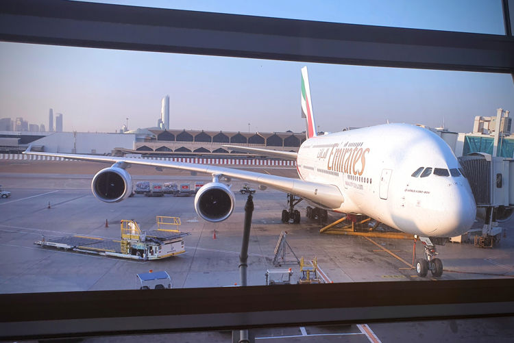

#emirates #aircraft/a380 #traveling/flying #story/flying-big-finally

# Flying big, finally

The A380, majestic beast that it is, has never trafficked any route I've flown. That is until I required a last minute flight to Thailand and Emirates came up as a competitive price alternative with two layovers.

This was going to be great, a high adventure no doubt! With one of the most reputable airlines in the world and the premier carrier using the A380 no less.

The fact that there is an entry here about this trip would be indication that this journey indeed turned in to a real adventure. After I had reached my destination I even told folks the trip was worthy of a literary epic when asked how the flights had been.  
True literary epic might be a bit of a stretch, but here we are!

Emirates A380 at Dubai airport.