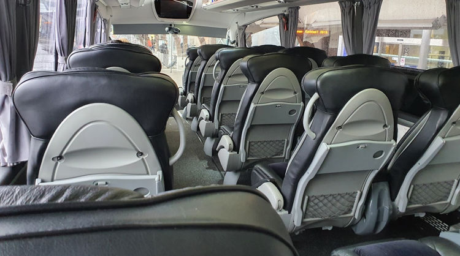

#traveling/bus #story/flying-big-finally #traveling/flying #airport/arn

# To the airport
It was bloody early. Long before the moons domain ended. Too early! First goal was to make the airport bus departing from the bus aprons of the central train station at 05:40. This is the time of day when even the city bus drivers are still asleep. Walking it was, at 05:00 in November, in Scandinavia. Cold.

Thankfully I have learnt how convenient it can be to travel with a backpack as main luggage. This was another moment proving it, walking would not pose problem for this traveler. I threaded the carryon backpack over my shoulders and across my chest, groaned while getting accustomed to its weight pulling me forward and shouldered the big luggage on the intended way - sandwiching myself between my precious carryon and the massive heap of baby clothes compressed in to my hiking backpack. Stepped in to my dress shoes - dress to impress and all that - which are easier to take off and put on than my usual boots. After all there was an expected minimum of three security checks and several flights over the next day and a half.

All mittens, caps and other winter paraphernalia were left behind, I was headed tropical after all. A wind breaker with a hood on top of a shirt would have to do. Excitement to be on the way hit and an unconsciously high walking pace follow. Together with being sandwiched between two heavy backpacks the feared cold turned in to welcome whiffs of fresh air. The bus stop soon was ahead of me and the station clocks showed I had walked quickly indeed, too quickly.  
Wait wait wait.

## Airport transfer bus
I had enjoyed the fresh early morning air. Apparently my fellow passengers with rolling luggage, thick jackets and mittens had not felt the same and requested the driver turn up the heat. Which he did, with a vengeance.  
The calf positioned close to the heating element of the bus was soon feeling the burn forcing a relocation of the carryon backpack in between the offending calf and superheated rail. Might explain why some of the pristine bananas I packed earlier were not as happy a few hours later. were s It was soon hotter than my equatorial destination was going to be, ridiculous.

By the time we stopped at the single stop between my embarkation and the destination airport I was red faced and utterly thankful to quickly take a few steps outside to cool myself and breathe some fresh air.  
Consuming some of the brought food was good and with forced focus almost half the work I had planned for the day was done by the time we pulled up to the airport.

Airport bus arriving at the airport.

## Airport chaos
There was none.

I had been warned, seen the news clips of overcrowded check-in halls and security lines stretching outside terminal doors. The shops and restaurants which had been closed my previous trips had opened up again and people were milling about as if the pandemic had never occurred.  
Of course I had taken an extra early bus to the airport to follow the airline suggested check-in time of three hours before departure and to counter any sudden reappearance of snow chaos which had plagued half the country the previous few days.

All in all I was early, very early. The departure boards did not list the check-in desks to be used yet. Thankfully the check-in desks did open at three hours before the flight. I suppose most people would not have read the fine print the way I do and might not know or not care about the suggested three hour check-in, because there were surprisingly few people stomping in the queue at that time and I was quickly on my way to the security point.

My metal thermos cup had been questioned in security before - maybe especially since I tend to stuff all the charging cables in there when unused. This time I knew to open the lid, place it in the tray next to the laptop and phone so it can be inspected easily. I was _not_ going to be the one to hold up the line this time.  
But of course I was. I did everything from no liquids, belt, laptop to thermos correctly. Except I had a pack of _Fisherman's friend_ in my pocket which made the security agent stop me two steps out of the scanner and ask me what was in my pockets.  
_"Nothing"_ was my response which elicited exasperated eyes from the agent.  
_"Please empty your right pocket"_ were the next words uttered.  
_IDIOT! What do you have in your pocket?!_ went through my head for the split second before my fingers made sense of what I was now fishing out of my pocket.

## The departure discussions
Soon let through and requested to always empty my pockets before security in the future. Put on my belt and packed my bag as quickly as I could while minding my motions so as to not appear as if the encounter had rattled me in any way. Which - if anything - probably made me more suspicious than anything else.

There is a little restaurant in the departure area where they have sandwiches acceptable to my allergy afflicted body. As per usual I headed there, but unlike usual it was an order of four baguettes.  
_"Wow, you are very hungry"_ the clerk jokingly commented as she rang me up on the till.  
In hindsight I should have made it five. But I had already spent a lot of money on this ticket and was now forced to buy expensive airport food to feed myself on the flights.  
_"I am a bit hungry, but actually the airline has decided to not feed me on my flights because of my nut allergies and their support suggested I bring my own food. So here I am, with full price tickets buying lots of expensive food in the airport because my carryon weight limit and size restrictions did not allow me to pack six meals."_ which stopped the clerk their tracks.  
As soon as the words stopped coming out my month I realized it had been an involuntary reaction of annoyance seeing how much I would have to pay. Their expression was hard to read, it might have been disbelief that an airline would do that or maybe she thought I was remarking on the joke. Not wanting them to believe their joke had offended me I added _"Oh, so sorry to offload on you like that. I was very surprised with the reputation of Emirates could not manage nut free meals and it has soured my mood."_

They held up their hand in a motion to stop, then turned around and grabbed a banana from the nearby fruit bowl and handed it to me together with the baguettes. While paying and giving my most sincere gratitude some other patrons caught my eye. It as now around lunch time and half a baguette and a pear would be my lunch.  
As I rummaging my bad for the laptop, charger and pear the person I had noticed after myself in the queue walked up _"It is amazing that they cannot give you anything on a flight, not even fruit?"_  
There were a number of people who had heard or now heard about my misfortune. Many gasps of surprise were uttered when they heard it concerned Emirates, their excellent reputation creates expectations. It turned in to a bit of a horror-stories-of-flying moment with several people sharing horrifying experiences at the hands of airlines.

> Excerpt from my feedback to Emirates  
> ... At the sandwich shop they joked I must be very hungry when ordering four until I told them Emirates would not feed me for my long flights and I was forced to buy food inside the airport, since there was no way I could fit that much food and my personal carryon luggage within the 7kg limit. At which point they offered me additional free fruits while shaking their heads. The exchange sparked a conversation between people around the shop for the next several few minutes.

> Excerpt from Emirates customer service response  
> Regarding the suggestion of bringing your own food onboard and your comment that such food would be included in the 7kgs carryon allowance you had, I am confident that the weight of the food you would bring onboard would not exceed 1 or 2Kgs, for the entire journey.

In the end about half the time I had expected to work ended up on the talking-trash slip of the time sheet. But that would not be a problem, there were hours of flights and layovers left to make up for it.

Snow clearing convoy at Arlanda airport.

Emirates 777 taxiing to the gate, my first flight of the trip was approaching.

