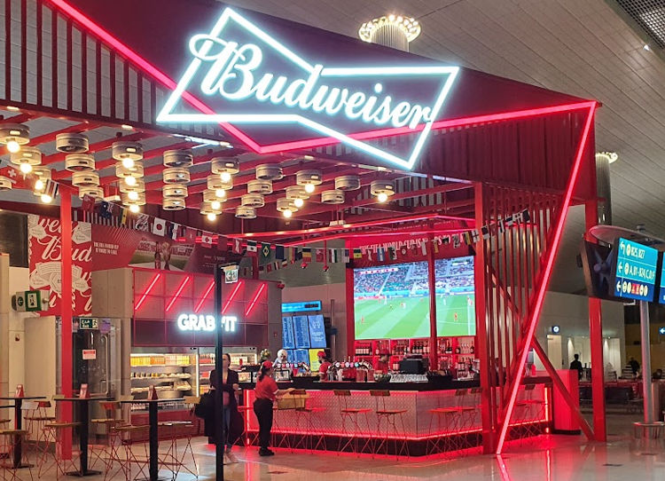
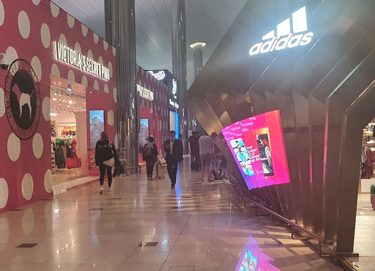
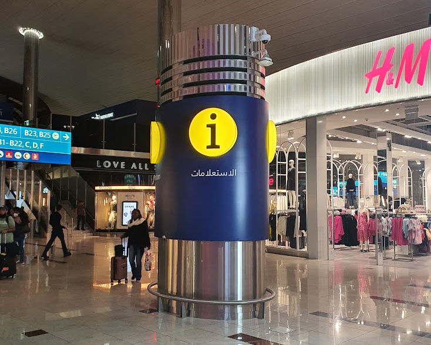
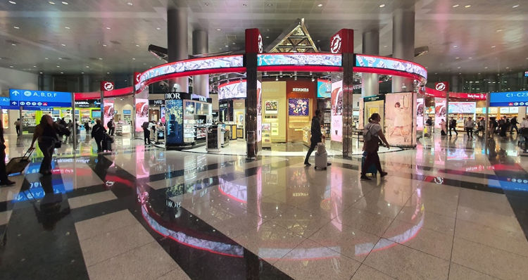

#dubai #traveling/flying #airport/dxb #story/flying-big-finally
# Arrival at DXB

Out of the flight I was feeling uneasy, restless and tired all at once. But mostly still cold and feeling the associated affliction of involuntary bouts of shivering. However I probably looked on par with most other people exiting a long flight, apart maybe from those folks subsidizing my economy ticket by paying significantly more for a first class ticket.

The very slight warm air currents of the airport was a very welcome change to the freezing gale of the last few hours. I set of towards the security check point and was soon in the concourse beyond. My flight would not leave for many many hours and the announcement screens did not extend close to long enough to show my flight.

New airport. How many terminals are there? Which would be the expected for me? Are the toilets nice? Do the toilets have bum guns? What time is it? Where should I go?

There was a fork in the road at the announcement screens, one way towards Terminals B and C and one towards A and D. I had no clue where to go. I decided to go in the direction most people were heading. Very quickly those people dispersed, it was probably not my way.  
Spotted a gentlemen sporting a vest, shirt and slacks answering questions from a few also seemingly lost passengers. Approaching I extended my half empty boarding card. The card had of course been printed at my port of departure many hours earlier when no gates or boarding times were known. The destination and time of departure was enough for the man to say _"I do not know the gate, wait to see gate on the screens."_, but he quickly added _"This terminal, it will depart from this terminal. Go back up the escalators and walk away from security exit."_  

Confirmed. I had chosen the wrong path at the junction, heading towards the transfers to Terminal A instead of staying in B-C building. Now I knew where to prowl. And prowl I did. Walking up and down both sides of the very long B-C concourse. Looking for secluded spots with presumably less frequented toilets and hopefully peaceful spots for a rest. 

Being the middle of the night I found the lights of the shops, stalls and billboards to be exceptionally bright in the terminal. Eye-wateringly so, children in strollers averting their gaze rather than being fascinated by the brilliance is probably as good an indication of too bright as anything.

Bright signs at Dubai airport.

More bright signs at Dubai airport.

All in all I walked about eight and half laps around the B-C concourse during the nine hours I was there that night. The concourse felt really long, I guessed around a kilometer half lap. With the google maps measurement tools I estimate that the length I walked from end to end is 1.65km, for a total of more than 14 kilometers walking not including detours and zigzags between shops, toilets and impressive windows overlooking the airport aprons. This would explain what happened next and the blisters I found the next day.

Pillar or column, column probably, a perfectly fine column... with a decided lack of information, contrary to its appearance.

Left to terminal B, right to the rest of terminal C. Very very shiny.

