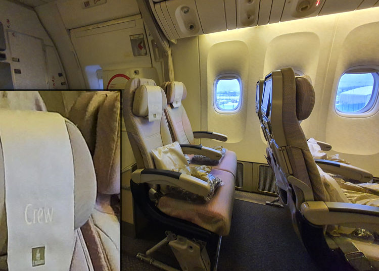

#emirates #aircraft/777 #story/flying-big-finally

# First flight
_What is wrong with the seat in front, why are the supports so weird?_ Oh well, it does not matter, I am in the aisle seat so I got slightly larger than usual footwell. In fact _Yay_!

How naïve I turned out!

The last few rows had been asked to embark at the same time as priority customers and with my seat on the very last row I was now seated before most other travelers. Curiously I gazed along the aisle to the front of the aircraft to see if any passenger might be heading all the way to my row.

For the next quarter of an hour I engaged in wild short-sighted speculation and judgement of people based on their appearance.

There was the young heavy large man with sweat stains around his neck and armpits marching towards me with determined steps. _He will overspill his seat no doubt. Oh no!_  
Stopped two rows ahead of me, looked at the seat numbers, turned around and forced the queue behind backwards a few rows. _Phew!_  

Next came the class clown. I based this judgement purely on tall lank frame of this younger man, the curly hair, the small round thin framed glasses upon a nose larger and rounder than the thin body would suggest. A clown.

Then there was the good looking young couple, still with hope in their eyes. New love? The two middle seats next to me were still unoccupied, they would probably care more about themselves than me. _If I have to have elbow buddies it will hopefully be them._ They stopped a few rows short.

Two kids came barreling down the chute next. They might be a split family! A worst case if they come to me! Those kids were old enough to sit by themselves in an airline sense, however any reasonable adult knows the age where they really can not be trusted to open an airline meal on their own, much less do everything required else required during a six hour flight.  
They slowed down when they reached the toilets behind me and turned to look for their parents. The parents were halfway along, carrying a lot of luggage and one toddler each. Generally I do not care about babies and toddlers on planes, I have noise cancelling headphones after all. But two children and two toddlers on two adults for all those hours, _No No No, not near me!_ The parents stopped almost at the beginning of the cabin section. _Oh the relief!_

## The unaligned seat supports
Getting a sore elbow from leaning out in to the aisle like the tower of Pisa I withdrew the e-book reader from my luggage under the seat in front and spent the next while enjoying the story. The flow of people diminished and hope was infringing on my mind; I might be seated next to one of the very few empty seats of the flight!  
Curiously the two last rows of two seats each along the outside of the aircraft were empty. If someone does sit next to me I will check if I can swap to one of those rows instead, this will be a great, I got options even! Again I was being short-sighted and in this case seemingly even near-sighted too I would soon find out.  

Then he was upon me. A large elderly gentleman with a slightly unsteady walk. Motioning that he had the seat next to me. After he had squeezed down in his seat and I got back in to mine he already had his leg in my footwell pushing against my carryon. _What is going on? Oh right. The weird chair supports._  

> Here I should explain that while he made my flight uncomfortable I do not blame this gentleman for anything that had or would come to occur. He is the victim of circumstance and bad design choices. He was in fact very nice and our few conversations were enjoyable if a bit formal and lacking in substance.

```
In my experience most wide body aircraft economy seating would look something
like the following diagram. With one seat support in between each seat, 
leaving one footwell for each passenger in the row behind.
  ___  ___  ___  ___
||:::||:::||:::||:::||
||   ||   ||   ||   ||     The double center support is only to make
||‗‗‗||‗‗‗||‗‗‗||‗‗‗||     my art look symetrical, usually it is the
|    |    ||    |    |     same thickness as the other four.
|    |    ||    |    |

On the two Emirates aircraft I have traveled with the center four seats
had only four supports. Spaced more or less evenly between the aisles.
  ___  ___  ___  ___
||:::||:::||:::||:::||
||   ||   ||   ||   ||
||‗‗‗||‗‗‗||‗‗‗||‗‗‗||
 |     |      |     |
 |     |      |     |
```

Now imagine sitting in one of the middle two seats as the gentleman was. People average or above in size will be forced to angle their outer leg in to the footwell of the seat outside or swivel their entire body in towards the center resulting in their back now being slightly turned to the passenger sitting outside, ME. This is exactly where we found ourselves for the next six hours.  
This man would either encroach on my legs or lean sideward over the elbow rest on to me. There was never a time when one of the two were not true.

During one of the times a toilet visit was required by my neighbor he stumbled a bit while trying to get out and reached out involuntarily. I do not mind helping and stood my ground. Unfortunately he snagged my shirt pocket and slightly tore the fabric around the pockets stitches. I felt it, it was an accident and it was already done - I let it go and did not mention it even if it soured my mood further. The man did not notice I am sure.

The pocket had long endured abuse by a baby that has found it amusing beyond belief to hide and retrieve the pacifier from said pocket while riding on my arm. The fact it has not ripped off completely a long time ago is more surprising than anything.
## The empty seats
Before getting ahead of the story let me share another slightly weird design choice.  
Those empty window seats were looking very attractive, to me and many others. However the gentleman next to me was very much more motivated than myself and did not want to wait for the embarking to even finish and asked me if he could get out to switch seats. I obliged and removed myself from his path.  
He had sat down across the aisle for less than a minute when a crew member informed him that those four seats are reserved. Another shuffle and he was back in his seat next to me.

Only minutes later a man from a few rows ahead decided to do the same and again the crew came only moments later to inform that those seats were reserved. This time indicating to the headrests of the four seats. The headrest tissue did have the word _Crew_ on them I noticed. However I doubt anyone would ever notice. The letters were slightly glossy but almost the same shade as the tissue itself making anyone not looking for it dismiss it instantly as a crease or play of light if noticing at all.

This occurred repeatedly up until taxiing and for the first quarter of an hour after the seatbelt sign had been turned off. With passengers coming from the other side of the cabin even to snag one of the empty twin seats. I even tried to curry some favor with the crew by informing some passengers approaching the seats. I failed to even get their attention before they had sat down.  
Then again I might well ignore a gesticulating passenger myself when I have my aim set on a toilet or seat. Besides, the crew would probably not have noticed what I had done anyway and just made other passengers angry with myself. I ignored the event after the second attempt.


Four crew seats on the Emirates 777. I do not think a single passenger noticed the _Crew_ text on the headrest, including myself.

## Fabulous crew
I manage to shove my bag of baguettes on the outside of the seat support in between and what I presume to be a foot guard in the aisle. This was to save the food from the uninvited guest of my neighbors foot in my footwell.  
Alright, this would get tiresome very quickly, but I can live with it for a few hours. With my carryon containing food and especially my medicine I do not want to stow it in the overhead bins if I can help it. But if it got unbearable I could pull those things out and put the carryon above and to allow more room for my legs.

When the cabin started settling down I waved one of the crew over and informed them of my allergy predicament and what I had been told by the Emirates support. They seemed shocked and had very clearly not been informed of my allergies at all.

> Excerpt from my feedback to Emirates  
> ... I spoke with the flight attendant and mentioned my allergies, she clearly had not been informed that I had any allergies. This is serious, since it meant my information had not been forwarded. I mentioned my conversation with the support and that I was supposedly not getting any food during my flights. She looked shocked and said that she would see what can be found. After a while she came back and had found fruits and an instant noodle cup and asked me confirm that I could eat it based on the ingredients list, which I confirmed.

> Excerpt from Emirates customer service response  
> Cabin Crew were indeed unaware of your situation as no special request was raised by the webchat staff due to the fact that we do not offer nut-free flights, ...

> Rebuttal  
> To be serious for a minute; this is a big red flag for me. That a company choses to not offer nut free alternatives is their choice, however when the staff and crew is not informed of the request they will try to feed said passengers with food which is known to possibly contain the very allergen the passenger was trying to avoid. _Not cool!_  
> This also prepared me for the fact they had almost certainly not relayed the information to my final flight, which was purchased through Emirates but conducted by Bangkok Airways.

The delicious noodle cup. Might have been my sense of satisfaction with having once again being proven right that the crew would indeed fix what management seems incapable of - or possibly just hunger - but that noodle cup was fantastic together with part of a baguette. As I mentioned in my feedback to Emirates I was offered an instant noodle cup and fruits by the amazing cabin crew and requested to confirm that it would be acceptable. I can only assume this was supposed to be the lunch of one of the cabin crew. Thank you however gave up their food for me, hopefully you enjoyed the impromptu inflight meal replacement!  

## The blizzard
This flight took off in November from Scandinavia, a season and place for thick jackets and other winter apparel. On this flight it seemed mandatory for passengers occupying some seats to have brought not only those jackets but the other paraphernalia as well. The gentleman next to me quickly put on his very thick jacket, greatly increasing his volume. Whereby my own allotted space shrank even more.  
Soon he was wearing the provided blanket as well. And for the first time ever I had to wrap myself in my blanket as well. The central air conditioning of this Emirates Boeing 777 seems to have some spots in the aircraft which receive far more of the cool air than other. The seats around mine had passengers wearing jackets and often blankets up to their necks. Me and many others multiple times reached up to see if our personal air outlet was accidentally open, it never was.  
Just a few rows away most had only a blanket, and often only over their legs. Towards the end of the flight I was blowing hot air over my hands as I would on a frosty Swedish morning while waiting for the bus. I was even asking for tea mostly so I could clasp the warm cup.  

## A hurry to get off... the aircraft
Shivering from cold and weariness after a long flight with no sleep I waited to see how people would behave when disembarking this time. You never know, might be ordered, civilized and unhurried this time. _Haha, we all know that is never true._  
We landed smoothly and soon taxied along the long taxiways of Dubai airport. After a minute or three some passengers who started to get out of their seats and reaching for the overhead bins. _Why folks? WHY would you do that?_  
One of the lovely cabin crew came on the intercom and reminded everyone to please remain seated with the seatbelts fastened until the aircraft has come to complete stop at the gate and the seatbelts sign has been switched off. A minute later we came to a gentle stop.

It was as if the start gun at an Olympic event had gone off. The rattle of belt buckles opening could rival a tommy gun for frequency and ferocity. Seemingly half the passengers hurriedly got out of their seats. Either everyone decided to not pay attention or simply ignored the fact that we were stopped on a taxiway and the massive terminal was still far in the distance.

The crew member came on again and loudly called out for everyone to wait until the seatbelt sign had been turned off. The exasperation in her voice was palpable for anyone paying attention, no matter the language. This time she also repeating the message in Swedish, our flight origin had been Sweden after all.
