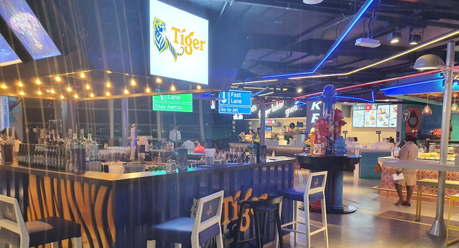

#dubai #traveling/flying #airport/dxb #story/flying-big-finally
# The hours of layover

## Finally up to temperature
After the hours of walking I was finally up to temperature and rather hungry. I filled up my thermos with water from a drinking fountain and headed to gate C20 which I had passed many times and only ever saw a single person at. Once there I slumped on one of the many benches, ate the last of my second baguette, read my book a bit and contemplated hibernation.
My body and mind was exhausted and I was not sure I would wake up from my alarm even at the relatively quiet gate C20, the circadian laws hitting me hard. This was not the moment to fall asleep.

When I existed the gate area I noticed there were far fewer people in general. I consulted the departure screens, a large wave of departures had taken place. Many of the travellators were empty and my mind started flirting with ideas of running along them, arms flailing and screaming as if hunted by a lion. Or better yet walking the opposite direction pretending to be stuck at that spot until someone noticed me and started a commotion.

Not tired enough to listen to the voices in my head I decided this would be my moment to find someone to talk to, surely there would be some other people around that wouldn't mind some company - or at least some idle chatting.  
I started doing another lap of B-C terminals and quickly found my self assigned task might not be as easy as I had thought. Most people were sleeping - probably waiting for the next big wave of departures just like myself. Those that were not sleeping were glued to their phones. Disturbing someone who might be in a video chat or watching a movie didn't feel right, find someone reading a book instead, disturbing that feels more acceptable somehow.

On more than one occasion I reflected I may be the only one at that airport that reads books. 45 minutes in to prowling it finally happened, I spotted a fellow reader in the distance and better yet they were looking up from their book. I immediately changed course, almost walking in to the path of one of the golf carts constantly ferrying people round the terminals.  
After the cart had departed my new path I saw the reader had put the book in their carry-on and were looking with a firm gaze at the nearby gate announcement screen which now read "boarding". I slowed and sure as poop in my baby's midday diaper a few seconds later they departed their seat and headed toward the gate.

If anyone was observing me disappointment would have been seen, before I set my mind to not dwell on it. After another half lap of the two terminals I said "screw it!" to myself and vied to approach anyone that looked talkative. Maybe someone using a computer rather than a phone, or maybe a group at one of the restaurant.  
A few steps later a lone girl sitting in one of the otherwise deserted restaurants caught the corner of my eye. She was staring rather intently at a screen, but there was no flickering lights of moving movie scenes directed at her face, and she had not spoken. She was probably reading! _GO GO GO!_  

Almost deserted restaurant at DXB.

## Shoutout to the between-jobs accountant
_"Would you mind some company?"_ I asked while approaching her table.  
_"Yes"_, she replied while seemingly indicating that she meant _"No, I wouldn't mind"_. I froze, my tired mind was not sure exactly how to proceed - Stupid opening line in a place where people are tired and might not natively speak English!  
She probably noticed my momentary hesitation and indicated more clearly to a chair, queue "whoop-whoop", "woohoo", "yea!" and other happy noises inside my head.

Turns out she had been working in the financial sector, recently quit her job and before her next gig started up she was going to visit her sister. A sister who - by international airport destination measurements - lived not far from my port of origin, now what's the chance of that I wonder.  
I have a feeling I rambled on a lot and didn't nearly ask her enough questions, but then again she might have been put off by being questioned in public by a stranger too much. It was lovely to have a break from walking and this young lady from Vietnam through Hong Kong now working in Singapore spent the next two hours conversing.

Once her flight was coming up she excused herself. I almost fell getting out my chair while getting up from the chair because after the inaction of the previous flight, hours of more or less constant walking and then sitting for two hours cramps hit my calves with fierceness the likes I have seldom felt.  
Considerable effort was spent to not show this stranger of my wobbly legs and beads of sweat threatening to appear. I waved and thanked her for the company and studiously pointed my toes in the opposite direction to minimize any chance of an awkward side-by-side walk after saying goodbye. Not that my lower legs permitted anything other than a slow stagger at that moment.  
My left big toe also started pinging my brain for attention, blister coming up probably.

The gasses I had been harboring in my guts quickly made their volume and whereabouts known after a few short steps, though the rumbling might indicate more than just some methane. My calves were grateful for the travellators as I made my way to the secluded toilets I had scouted out earlier. The bad had seemingly gained weight during my chat, a voice in my head spoke up sarcastically to tell me _"Maybe the girl had secretly dumped a bunch of contraband in my bag while I was chatting"_. Once at the porcelain throne my knees felt weak and I sat heavily with a sigh.

## Final moments
Feeling far lighter afterwards I stretched quietly in the dimly lit terminal extension, acutely aware that there were people sleeping under and behind the rows of seats along the walls. I refilled my thermos and while stowing it back in my backpack I noticed the sorry state of the last remaining banana, the one gifted to me at the departure lounge an eternity earlier. The banana had clearly suffered gashes, nudges and poking by the other bag contents. The bruising told me it was probably time to eat it or risk banana mush in the future. It was delicious.

After the chat, toilet break, impromptu banana and realizing just how many hours I had managed to lose I found myself reinvigorated and the remaining time to boarding seemed positively tiny by comparison.

Another lap and half around the B-C departure concourses went by before I told myself it was enough, quarter of an hour remaining before the boarding was to commence. The horde of people at the departure area for the gate spilled out in to the concourse. 

I dutifully waited, we're all getting on the same aircraft after all. Besides, my tired mind was not feeling like bustling elbow to elbow with the other patrons at that moment. In this case spoils really did go the patient, because while others had lined up in a long winding queue I just sat back on the now empty chairs next to the boarding desks. Only moments later they opened another desk, which went unnoticed by everyone bustling in queue. When I locked eyes with the boarding agent they were happy to wave me over, presumably hoping that more people would notice and follow my lead.

Being the first time at Dubai airport and the first time boarding an A380 I was almost run over as I walked slowly trying to decipher which arm to use to enter the aircraft. The voice in my head piped up again and said _"Go to the wrong one so you have a reason to tour the entire plane!"_.
