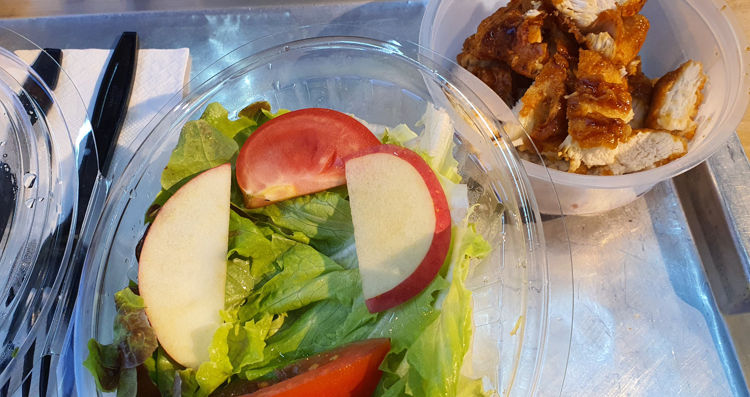
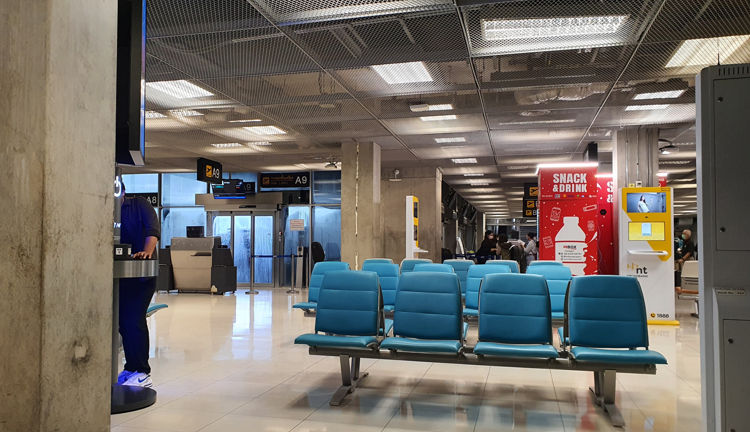
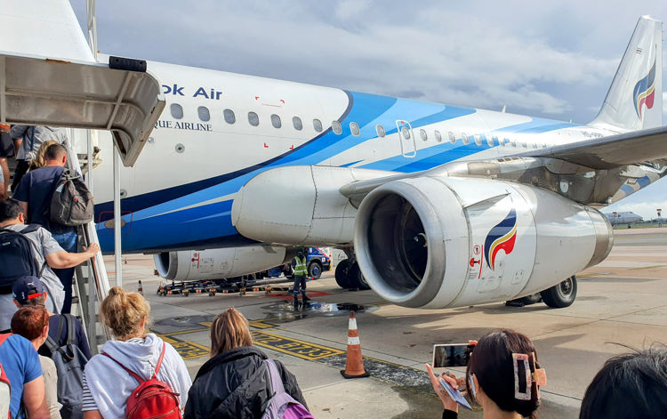
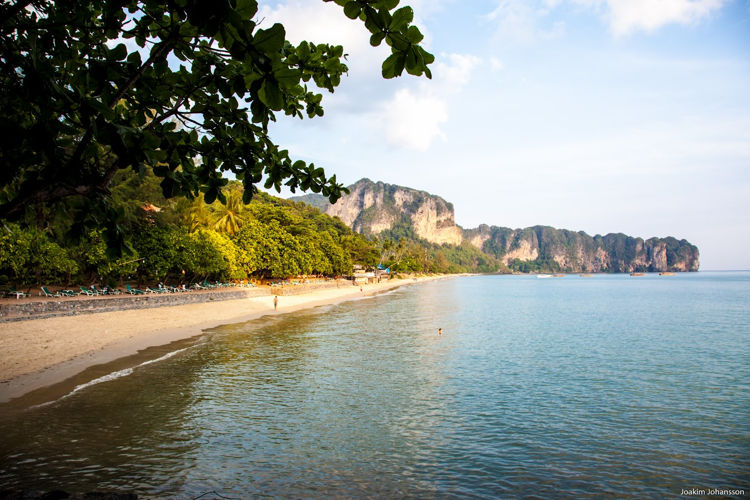

#bkk #traveling/flying #aircraft/a319 #food

# Final leg
After getting off the giant of the skies I was hungry, the last baguette had only been for the first meal. The second meals only solid part had been a tiny banana I had missed among the other things in my bag and the one remaining plum.

As soon as I had cleared immigration I headed towards the domestic departures even though it would be many hours still until my last flight. I had managed to sleep a few hours on the six hour flight from Dubai to Bangkok, but the haze my thinking was blanketed in told me it had not been nearly enough. Previous experience told me there were restaurants after clearing the domestic departures gate. Turned my pelvis that way and set off as quickly as my sleepy legs and body would allow. The calves and a developing blister made themselves known when I tried to stretch my legs properly and build some speed down the long hallways.

I felt coordinated and determined if tired, final destination soon at hand. From the outside I probably portrayed a drunkard much better than the smartly dressed man I was going for. More than a day and half of traveling had left very few patches without creases on my shirt and the blister made me favor one leg and the pace was most likely arthritic-leg-joint-speed. Not to mention my expression was most likely somewhere between paralysis, exhaustion and general grumpiness.

Fresh food was fantastic, delicious chicken salad at Bangkok Suvarnabhumi airport.

The boarding pass had of course been issued when my shirt was still mostly unmolested and they knew nothing of the flight except for the flight number. This made the staff checking boarding cards at the checkpoint for the different domestic departure wings confused and asked what gate I was going to.  
I had of course checked the gate on the departure screens while at the restaurant. But they seemed unconvinced. Might have been the involuntary zombie expression. Instead of pushing the issue I turned on my heels and walked back to the nearest departure screen and snapped a photo with my phone.  
Upon returning to the checkpoint I showed the photo and was let through with enthusiasm and smiles I know well from the friendly people of Thailand. However in this instance it just seemed excessive, annoying and even mocking!

## Departure

The mentioned previous knowledge had never led me to the particular gate area of my departure. I assumed it was just another wing of the airport. However it turns out when you are boarding small flights that require an airport shuttle to a remote aircraft stand you get to pass security and then be stuck in a waiting area with just about nothing. Well there are the vending machines, a general basement feel, a lot of chairs and air-conditioning creating waterfalls down all surfaces even remotely close to any of the sliding doors letting in humid air when used to board the shuttles.

BKK waiting area for departures requiring shuttle to get to the aircraft.

In the future I will only pass that particular security check when my boarding has started. The restaurants would of course have been a much better place to remain. As it was I was stuck for several hours in this monument to concrete, fluorescent lights and artificially chilled air.

It was a great relief when my flight was finally called. I had tried to do some work, but did not manage to string together more than few seconds of focus and quickly gave up. Programming on a sleep addled mind is never a good idea, you end paying for it when you are later forced to refactor the poop you created.

Compared with my last two flights it was almost comical to see the tiny aircraft lined up on the remote stands we passed with the shuttle bus on the way to our Bangkok Air branded metal bird.

Boarding the A319 aircraft operated by Bangkok Air for my last flight.

## An hour left

Surprisingly they had a hot meal for this morning one hour flight. And when I enquired if it contained eggs, seafood or nuts they confirmed it did. The absolutely lovely crew member came back to me a bit later and with seemingly genuine sorrow informed me that they had no alternatives on board. And told me I should contact them before to arrange special meals.  
I pointed to the Emirates logo on the boarding pass sticking out of my shirt pocket and explained that I had booked the flights through them and that they had clearly not forwarded my information - of course I already knew they would not have. And explained I had not thought to contact them directly myself beforehand.

To make sure it did not happen again she gave me several methods on how I can get in contact with them in the future for any questions or special requests. This is some excellent service. Even though there was nothing they could do for me except offer additional drinks it was a very pleasant interaction. The quick flight was soon coming in for landing leaving me with much more positivity after the flight than before.

As we were taxiing to the the stand in front of the tiny terminal we were informed that international passengers needed to pick up their luggage separately from the domestic. I figured this applied to myself, since my luggage had been internationally checked in for all three flights. Not a moment had been spent wondering about my luggage - until that moment.  
What if my luggage had an even worse fate than me and did not make it?

&nbsp;

Destination reached.