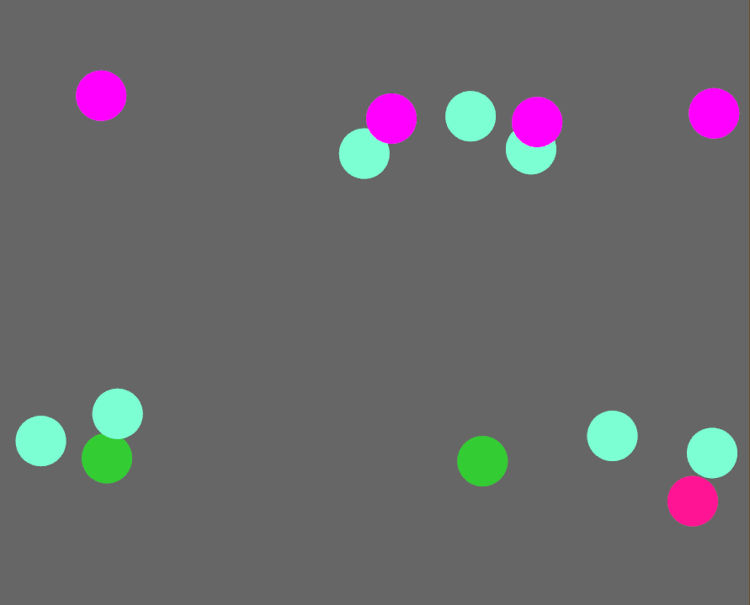

#game #rust #bevy #programming #magic-mirror

# A game for the magic mirror

The magic mirror project will of course need some content to show. One of the things I want to include are games. 

This felt like a great learning opportunity by using the Bevy game engine for the first time. I had previously bailed out of using it because I felt my knowledge of the Rust programming language would hold me back.

## The premise
A simple concept; objects are falling on the screen and the player needs to hit the objects before they reach the bottom to stay in the game.  
The longer the game goes on the more objects there will be and the higher your score will be.

This concept should be easy enough for even my two-year-old to understand. Who will realistically be closer to three by the time this is actually up and running on the finished magic mirror.

## Extracurriculars
I also want to be able to send results to a server and store scores to enable scoreboards and tournament play. This will teach me the basics of networking a Bevy application.

The players could use their phones to navigate to a very simple web app on said server, pick their identity and view their score, or perhaps a real-time updating score for the current player. Possibly influence the game itself in some way.

This again is part of the learning process for me, how do I setup a server with real-time sockets and such. I have no idea.

## Just do it!
I ran my `rustup update` and setup a new Bevy project. Checked the examples on how to spawn things. Waited for `cargo run` to compile while watching my laptop battery drain before my eyes.  
**Thank the technology gods for incremental compiling!**

The game needs to know when to spawn the targets throughout the session. The [builder pattern](https://doc.rust-lang.org/1.0.0/style/ownership/builders.html) seemed like a great way of being able to declare waves of targets and their data.  
This resulted in something like this:
```rust
  //Create a builder with default velocity for targets of 20.0.
  WavesBuilder::new(20.0)

    //Set the duration of all subsequent waves.
    .set_duration(6.0)

    //Add a new wave.
    .wave()
    //Add 1 target of kind `regular`.
    .add(TargetKind::Regular, 1)

    //Increase the velocity by 4 for each wave.
    .set_vel_increase(4.0)

    //Add a new wave, which will start after the 
    //duration of the previous has finished.
    //This wave will have a specific duration of 2 seconds.
    .wave_with_duration(2.0)
    //Add 2 targets to wave.
    .add(TargetKind::Regular, 2)

    //Add another wave.
    .wave_with_duration(10.0)

    //Add 4 targets to wave.
    .add(TargetKind::Regular, 4)
    //Add 2 more targets to wave. The first 4 will spawn during the
    //first half of the waves duration. These 2 targets will spawn
    //in the second half.
    .add(TargetKind::Regular, 2)

    //Trigger building of the struct which holds all the
    //wave data such as what kind of targets, how many
    //velocities, when to spawn ...
    .build();
```

This allows me a fairly easy way of configuring the waves and their difficulty. As long as the resulting struct remains the same I can expand on the functionality of the builder later.  
It is also worth noting that for the time being there is only one kind of target. But the idea is that multiple kinds of targets can be supported in the future.  
Maybe they have different behaviors and visuals;
 - change in size over time instead of falling down,
 - change their velocity in bursts,
 - zig-zag their way down,
 - rise like bubbles instead of falling from top to bottom,
 - ...

## First results


There is life; first few targets are spawned and slowly falling.

In the image we can see one color per wave, pink for the first, green for the second and so on. They are clumped together because the velocity between the waves is increasing so as the fall further the later waves start to catch up.  
Of course this is all configurable with the wave builder as we saw.

It feels like a good amount of progress to start off. Next item of business will be to handle interaction.