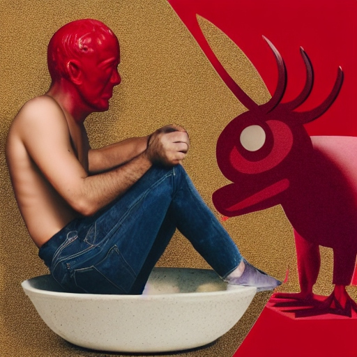

#morning-musings

# Morning musings #1 - The morning toilet break

Being a baby parent priorities quickly straighten out.  
In the beginning I mourned waking up at my own pace, time for hobbies, where did the money go?!

I remember the quiet morning dumps with fondness and longing. A year or two in and some respite to use the toilet in peace in the morning is all I want.   

I'm not talking about a 20 minute deluxe visit with the phone. What I need is 90 seconds, hell, even that seems excessive. Give me 60 seconds and I'll force my business out with a face contorted and red enough to make Lucifer blush.

_This morning musing was brought to you by my luxuriously long, uninterrupted and quiet toilet visit. Thank you whoever is making those colorful edutainment videos for kids!_

&nbsp;

------

Here are some AI generated images based on variants of the prompt _"man on toilet with devil looking on"_. Many AI sites apparently find _toilet_ to be so offensive that you can not use it as a word in a prompt. So I had to use _bowl_ or _marble throne_ instead.  

