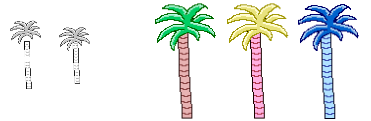
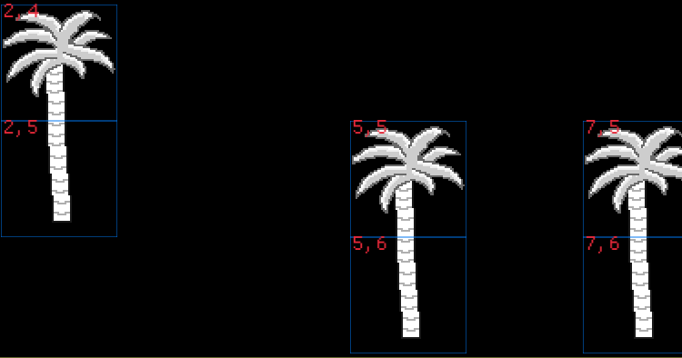
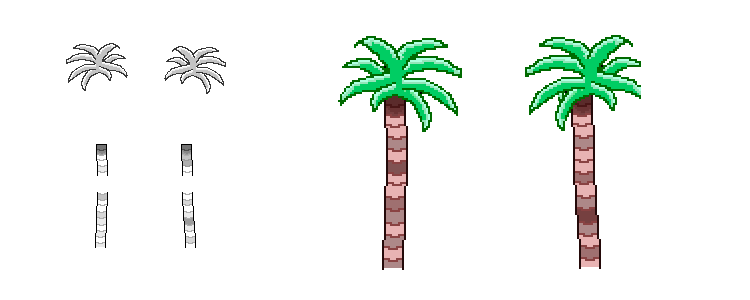

#pixel-art #treris #macroquad #rust #programming

# First sprites

To have something to work with when programming I first set out to make a tree. A palm tree seemed easiest. It is composed of three separate sprites. Two for the trunk and one for the leaves up top.

First tree sprite. Then the result when colorized in the application.

Next point of order, setup a new Rust project and add some dependencies. I added the Macroquad dependency and started writing code for loading the sprites.  
Very quickly I had sprites loading and drawing to the screen in a grid fashion. At this point it was hardcoded where they were positioned. Next up would be to have some way of loading a "world", and based on the info within that world pick the correct sprites to draw.

## The world
As I had planned for the prototype I created an image. For anyone unfamiliar with digital images they are represented by pixels, each of which are represented by four values between 0 and 255;
  - Red
  - Green
  - Blue
  - Alpha (transparency)

Each pixel in the image would represent one square in a grid in the application. Each of the four values would represent one layer, so I can stack up to four layers of images in one square.

### A tree example
To make a tree I would for example decide that;  
`palm tree trunk bottom` has `Green 1`,  
`palm tree trunk top` has `Green 2` and  
`palm tree leaves` has `Blue 1`.

In the world image I would then pick a spot and set the pixel value to `R0 G1 B0 A0` and then the pixel above it to `R0 G2 B1 A0`. When Treris loads the world image it will then look at every pixel and split it to `Red`, `Green`, `Blue`, `Alpha` and draw the matching images.

In this example it would find one pixel with `G1` and nothing else, so it will draw the `palm tree trunk bottom` and above it a pixel with `G2` and `B1`, in which case it first draws `palm tree trunk top` and `palm tree leaves` on top of it.

Top left shows the result of pixel `2,4` _(column 2 and row 4)_ of the world image. In this example that pixel would have `R0 G2 B1 A0`. Below it is cell `2,4` with value `R0 G1 B0 A0`, representing the `palm tree trunk bottom`.

The app considers the world to be a grid, where each cell has one or more layers of sprites based on the color code in the corresponding world image pixel.

***Why?*** Would be an appropriate question at this point.  
The quick is answer is that it is... quick. It allows me to very quickly open my favorite drawing tool, change some colors and have a new world. Game engines of any kind already know how to read and write images so I can leverage the same code for loading a sprite as I do for a world map.

All of this means I can spend more time on other things when prototyping.

&nbsp;

***But why?*** Another aspect one might question would be why cut the palm tree trunk in two?

It makes sense that the leaves and trunk has to be separated, so that they can be colored individually. However the trunk will be the same color.

By cutting the trunk in two I can make different looking top and bottom pieces, many of them. By randomly picking a top and bottom I can get a great number of variations. As long as the pieces align properly.

By having two leaves, two trunk top and two trunk bottoms 8 unique palm trees can be created. Here are two examples.

This of course applies to anything larger than a single tile. For example a house front can be with or without a window, with or without a balcony, with some missing paint or have a door, combining all these would make the houses unique and the world seem more alive.