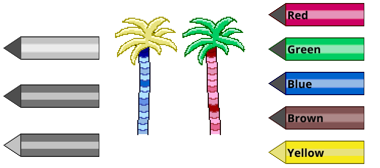

#pixel-art #programming #treris #macroquad

# Palettes
The `palette` system I thought of as a set of related hues of a color, with some possible other colors mixed in too. When the user hits a tile layer sprite the selected `palette` color can be associated with that layer and its sprite. When drawing the sprite each pixel can be compared with the associated `palette` and the correct color used instead of the gray scale.


An example of a blue palette, going from light to dark blues and slightly different hues.


```
Technical note

For any programmer reading this the actual tile texture is created when any of its
layers change; all layers sprite are colored and then composited. There is only ever
none or one 64x64px texture per tile and the updates are only done on interaction.

The pen textures mentioned below are generated on startup, never recreated and 
referenced as necessary.

So far even with a ridiculously large world with every tile filled with maximum 
number of layers the only thing changing is a very slightly longer startup time
when the initial tile sprite layers are composited and saved to gpu memory.

For a prototype I am very happy with the performance.
```


## Letting the user pick the palette
Now of course the user needs to have a way of selecting which `palette` they would like to use. For this I created a few versions of a pen. This pen can then be colored with the appropriate `palette` using the exact same system as for all the other sprites. Again saving my time.

I tried using the UI system which comes with Macroquad, after two hours I found it frustrating and not easy to combine with my system of coloring oddly shaped pens. It was eating in to my tight prototype deadline so in the end I created my own very basic UI functionality and added a few `palette`-buttons to the app. The buttons can also have labels on them.


Three slightly different pen icons to allow changing the looks when the user selects a color. In this case the Yellow is selected, showing color on its tip.


## Connecting the tiles
The eagle eyed reader might have noticed that above described processes would result in the bottom of the palm tree trunk receiving one palette and the top trunk none if the bottom was clicked.

This lead to the next step, connecting associated tiles.  
The problem to solve in this case is that a tile does not know what any neighboring tile is or if it should be "connected". To solve this I create lists of sprite codes that should belong together. Then when the user clicks a tile we can check if the sprite is in a list and if so check any surrounding tile for a match in that list.

If we find surrounding tiles that are part of the same sprite list the same palette should be applied to that tile as well.

```
Technical note

When a tile is clicked the surrounding tiles are recursively checked outwards until
no more matches are found. This results in a group, that group is then saved in a
hashmap. The hashmap is then consulted on any future clicks to see if a group has
already been created for the tile/sprite combination.

Inspecting the code a few days later I am sure it doesn't work the way I think.
But so far it does work. With larger sets of connected tiles bugs might well pop up.
For now I have supressed the urge to refactor it, it is a prototype!

Saving this small amount of processing to a hashmap is of course complete overkill
and could easily be done with simpler methods. But since I had to calculate the
groups anyway it just made sense to save the results.

I have yet to have any connected tile group large enough to even measure the 
performance. More than fast enough for this usecase with a target of 15-30fps on
mobile devices, saving as much battery as possible.
```
